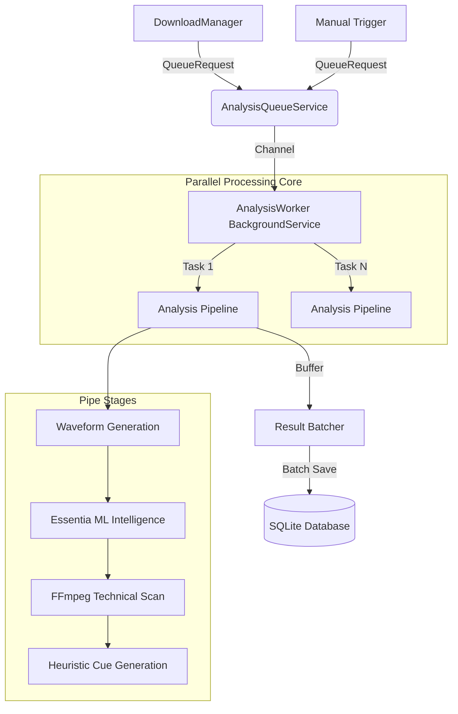

# ORBIT Audio Intelligence: End-to-End Analysis Queue Architecture

## 1. Executive Summary
The **Musical Brain Orchestrator** is a multi-stage, high-performance pipeline designed to transform raw audio files into enriched, data-driven musical assets. It balances intensive CPU-bound operations (Machine Learning via Essentia, DSP via FFmpeg) with a responsive user interface through an asynchronous **Producer-Consumer** architecture.

## 2. High-Level Pipeline Architecture
The system follows a decoupled architecture using high-performance messaging and background workers.

---

## 3. Core Components

### 3.1 AnalysisQueueService (The Registry)
The `AnalysisQueueService` acts as the single point of entry for all analysis requests.
- **Messaging**: Uses `System.Threading.Channels` (Unbounded) to prevent producers (like the Download Manager) from blocking on I/O.
- **Thread Tracking**: Maintains a `ConcurrentDictionary` of active threads to feed the "Mission Control" dashboard in the UI.
- **State Management**: Handles global Pause/Resume logic.

### 3.2 AnalysisWorker (The Consumer)
A `BackgroundService` that manages the lifecycle of the actual processing.
- **Dynamic Parallelism**: Auto-detects the optimal number of worker threads based on CPU core count (via `SystemInfoHelper`), typically targeting $N$ concurrent analyses.
- **Concurrency Limiter**: Employs a `SemaphoreSlim` to strictly enforce CPU caps and prevent thermal throttling.
- **Execution**: Orchestrates the 4 main stages (Waveform, Musical, Technical, Cues) per track.

### 3.3 EssentiaAnalyzerService (The Intelligence Layer)
The "Heart" of the musical brain.
- **CLI Wrapper**: Executes `essentia_streaming_extractor_music.exe` in a low-priority process.
- **Extraction**: Parses JSON output to extract 50+ features including BPM, Key, Scale, Danceability, Energy, and Mood.
- **Sidecar Models**: Integrates specialized TensorFlow models for Electronic Sub-genre detection and Arousal/Valence mapping.
- **Resilience**: Implements a 120-second watchdog timer per process to prevent hung CLI instances.

### 3.4 AudioAnalysisService (The Technical Layer)
Ensures "Sonic Truth" and technical compliance.
- **Loudness**: Measures integrated loudness using the **EBU R128** standard (-14 to -8 LUFS target).
- **True Peak**: Detects inter-sample clipping using FFmpeg's `ebur128` filter.
- **Integrity Scout**: Analyzes spectral frequency cutoffs to detect **fake lossless** or upscaled files (e.g., a 128kbps file upscaled to FLAC).

---

## 4. Multi-Stage Pipeline Logic

| Stage | Technology | Output | Impact |
| :--- | :--- | :--- | :--- |
| **1. Visual** | FFmpeg PCM -> Buffer | Waveform (Peak/RMS) | UI Visualization |
| **2. Musical** | Essentia ML | BPM, Key, Mood, Vibe | Search/Recommendation |
| **3. Technical** | FFmpeg Filter Graph | LUFS, TruePeak, Cutoff | Sorting/Quality Control |
| **4. Curation** | Frequency Heuristics | Intro/Build/Drop Cues | Auto-DJ / Quick Preview |

---

## 5. Resilience & Data Integrity

### 5.1 Result Batching
To prevent SQLite write-lock contention (common in multi-threaded P2P environments), ORBIT uses a **Write-Behind** strategy:
- Results are collected in a `_pendingResults` buffer.
- A **Batch Flush** is triggered every 10 tracks or every 5 seconds (whichever comes first).
- This significantly reduces the overhead of database transactions.

### 5.2 Forensic Auditing
Every analysis run is tracked via `AnalysisRunEntity`:
- **RunId**: Unique GUID for every attempt.
- **Latency Tracking**: Millisecond-precision breakdown of each stage (FFmpeg vs Essentia).
- **Error Capturing**: Full stack traces are saved to the DB for failed runs.
- **Thread ID**: Records which logical thread processed the track for debugging race conditions.

### 5.3 SQLITE_BUSY Recovery
The persistence layer implements an **Exponential Backoff Retry** policy:
- If the database is locked (Code 5: SQLITE_BUSY), the system waits $500ms \times retryCount$ before re-attempting the save.

---

## 6. UI & UX Integration

### 6.1 Mission Control
The `AnalysisQueuePage` provides a real-time "cockpit" view:
- **Active Threads**: List of current workers with progress bars and status (e.g., "Analyzing Moods...").
- **Throughput Metrics**: Tracks-per-minute speedometer.
- **Estimated Completion (ETA)**: Accurate time-to-finish based on active queue size and historical performance.

### 6.2 Track Inspector
Provides a "Deep Dive" forensic report for any analyzed track, including the spectral histogram and the "Sonic Integrity Score" (Verified vs. Suspicious).

---

## 7. Configuration & Optimization

Users can tune the "Brain" in `appsettings.json`:
- `MaxConcurrentAnalyses`: Set to `0` for auto-detect (recommended), or a specific number to limit CPU usage.
- `AnalysisTier`:
  - **Tier 1**: Basic BPM/Key/Waveform.
  - **Tier 2**: Full AI Vibe Detection + Cues.
  - **Tier 3**: Deep Learning Embeddings (Vector Search).

---
*Created by Antigravity AI for MeshDigital/ORBIT - Jan 2026*
