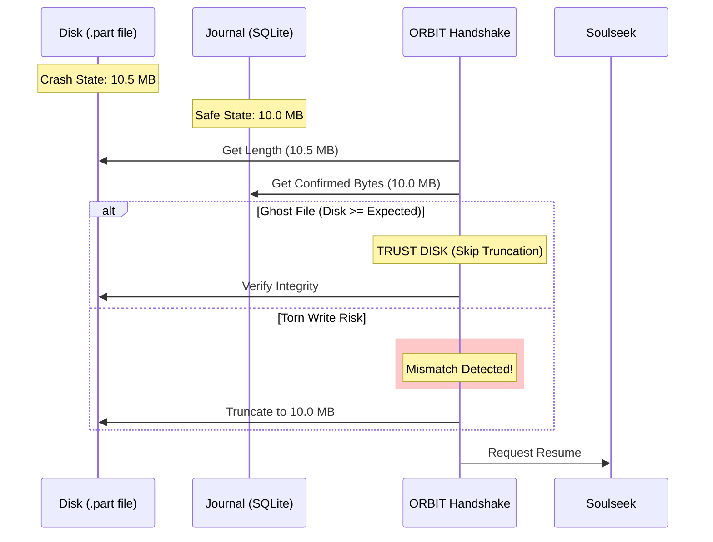

# ⚛️ The Atomic Download System

> **"Trust the Journal, Truncate the Disk."**

Phase 3A introduces **Atomic Resumability**, a zero-trust architecture for handling interrupted downloads. Unlike traditional clients that blindly resume from the end of a partial file, ORBIT forces a "Handshake" between the disk state and the database journal to guarantee data integrity.

---

## 🛑 The Problem: "Torn Writes"

When a standard P2P client crashes or loses power:
1.  **Disk**: The OS might have flushed 10.5 MB of data to `track.mp3.part`.
2.  **Reality**: The last 0.5 MB might be trailing garbage, zeros, or an incomplete frame that wasn't properly acknowledged.
3.  **Resume**: The client resumes fetching at 10.5 MB.
4.  **Result**: The audio stream has a "glitch" or pop at the seam, or the file becomes corrupt because the bitstream alignment is lost.

---

## 🛡️ The Solution: Journal-Backed Handshake

ORBIT never trusts the file system blindly. Instead, it relies on the **Crash Recovery Journal** as the "Source of Truth".

### The Handshake Logic

Before reserving a download byte range, `DownloadManager` performs this check:

```csharp
long diskBytes = new FileInfo(path).Length;
long confirmedBytes = await _crashJournal.GetConfirmedBytesAsync(id);
long expectedSize = metadata.Size;

if (diskBytes >= expectedSize)
{
    // GHOST FILE EXCEPTION: Disk has full file, Journal didn't finalize.
    // ACTION: Trust the disk (verification will catch corruption).
    // Do NOT truncate.
}
else if (diskBytes > confirmedBytes)
{
    // TORN WRITE RISK: Disk has confirmed tail or garbage.
    // ACTION: Truncate to confirmed offset.
    FileStream.SetLength(confirmedBytes);
}
```

### Visual Flow



---

## 🧩 Architectural Components

### 1. The Heartbeat (Update)
The `PeriodicTimer` in `DownloadManager` doesn't just log "alive" status—it logs the precise **byte offset** that has been successfully received and written.

*   **Frequency**: Every 15 seconds.
*   **Threshold**: Updates only if > 1KB of *new* data is received (SSD saver).
*   **Safety**: Uses `Interlocked.Read` to prevent reading the byte counter while it's being updated by a socket thread.

### 2. GetConfirmedBytesAsync
A specialized, high-speed query in `CrashRecoveryJournal` that uses `JsonDocument` to parse the `StateJson` column without needing full object deserialization.

*   **Cost**: < 0.5ms (uses Prepared Statement).
*   **Isolation**: Runs on the dedicated Journal connection pool.

### 3. Atomic Finalization
The resume protection extends to the final move:
1.  **Download Complete**: File hash is verified (Phase 8).
2.  **Atomic Rename**: `File.Move(part, final)` executes.
3.  **Journal Commit**: Checkpoint is deleted **only after** the move succeeds.

---

## 🚀 Benefits

| Feature | Old Behavior | Atomic Behavior (Phase 3A) |
| :--- | :--- | :--- |
| **Crash at 99%** | Resume or Corrupt File | Resume from last safe checkpoint (98-99%) |
| **Power Loss** | File might contain null bytes | Truncates to valid data before resume |
| **Log Files** | Manual cleanup needed | Automatic cleanup/recovery on startup |
| **Audio Quality** | Glitches at resume points | Bit-perfect continuous stream |

---

## 🔍 Verification

You can verify this system is working by triggering a crash during a download and checking the logs on restart:

```log
[WARN] ⚠️ Atomic Resume: Truncating 4509 bytes of unconfirmed data for Deadmau5 - Strobe
[INFO] Resuming download from byte 10450920 (Journal Confirmed)
```
