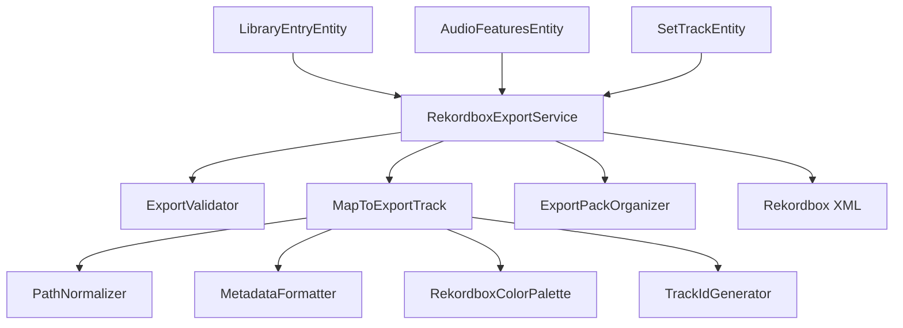

# ORBIT Architecture: Phase 4 Export Pipeline

The Phase 4 Export Pipeline is the deployment bridge that translates ORBIT's deep musical intelligence into industry-standard metadata and cues for Rekordbox DJ hardware.

## 🏗️ Component Overview

```mermaid
graph TD
    A[LibraryEntryEntity] --> B[RekordboxExportService]
    C[AudioFeaturesEntity] --> B
    D[SetTrackEntity] --> B
    
    B --> E[ExportValidator]
    B --> F[MapToExportTrack]
    
    F --> G[PathNormalizer]
    F --> H[MetadataFormatter]
    F --> I[RekordboxColorPalette]
    F --> J[TrackIdGenerator]
    
    B --> K[ExportPackOrganizer]
    B --> L[Rekordbox XML]
```

### 1. ORBIT Export Service (`RekordboxExportService`)
The orchestrator. It manages the lifecycle of an export session, from validation to XML generation and file organization.

### 2. The Intelligence Mapper (`MapToExportTrack`)
The "Brain" of the export process. It synthesizes multiple data sources into a normalized `ExportTrack` model:
- **Cues**: Merges manual `OrbitCue` objects with auto-detected `PhraseSegment` data.
- **Roles**: Automatically assigns Rekordbox types (Hot Cues vs. Memory Cues) based on the cue's structural role.
- **Colors**: Maps ORBIT roles (Drop, Build, Intro) to official Pioneer standard RGB values.

### 3. Forensic Metadata Formatter (`MetadataFormatter`)
Encodes ORBIT-exclusive intelligence into the Rekordbox **Comment** field using a structured `[ORBIT]` block.
- **Fields**: Energy, Instrumental Probability, Forensic Notes, and Transition Reasoning.
- **Culture Safety**: Enforces `InvariantCulture` (dots for decimals) to prevent parsing errors on non-English DJ systems.

### 4. Cross-Platform Path Normalizer (`PathNormalizer`)
Ensures that tracks are findable across Windows and macOS.
- **Standard**: Converts local paths to `file://localhost/` URI format.
- **Encoding**: Properly escapes spaces and special characters (`%20`) for reliable Rekordbox import.

### 5. Pre-flight Validator (`ExportValidator`)
Prevents "broken" exports by checking:
- Physical file existence.
- Mandatory metadata (BPM, Key).
- Analysis status (ensures AI features like segments are present).

## 🧠 Intelligence Mapping Logic

| ORBIT Feature     | Rekordbox Equivalent | Type             | Target Color         |
| :---------------- | :------------------- | :--------------- | :------------------- |
| **Intro / Outro** | Structural Marker    | Memory Cue       | Green                |
| **Drop**          | Energy Landmark      | Memory Cue       | Red                  |
| **Build**         | Transition Zone      | Memory Cue       | Orange               |
| **Breakdown**     | Mid-section          | Memory Cue       | Yellow               |
| **User Cues**     | Trigger Points       | Hot Cue          | Custom (Blue/Purple) |
| **Mix-In Point**  | Set Alignment        | Hot Cue (Slot 7) | Purple               |

## 🛠️ Data Flow & Production Hardening

1. **Validation**: `ExportValidator` checks all chosen tracks/sets for physical file existence and mandatory BPM/Key metadata.
2. **Translation**: `MapToExportTrack` creates normalized export models, merging ORBIT cues with detected segments.
3. **Pioneer XOR Encryption**: The `XorService` and `AnlzFileParser` handle the proprietary Pioneer binary structure for cue point persistence, ensuring compatibility with CDJ hardware.
4. **Memory-Safe Serialization**: Unlike standard XML DOM manipulation, ORBIT utilizes `XmlWriter` to stream nodes directly to disk. This ensures that a 50,000-track master library can be exported on hardware with as little as 4GB of RAM without memory exhaustion.
5. **Windows Path Normalization**: Resolved the critical `%3A` colon bug. ORBIT correctly restores the local file URI format (`file://localhost/C:`) during serialization, preventing Rekordbox from failing silent imports on Windows systems.
6. **Assembly**: `ExportPackOrganizer` manages the final folder structure, copying audio assets and writing the `COLLECTION.xml`.

## 🎨 Aesthetic Integration
The Export View utilizes the **Pioneer Cyan** (`#00E5FF`) palette to provide visual context that the user is now interacting with external DJ hardware ecosystem.
