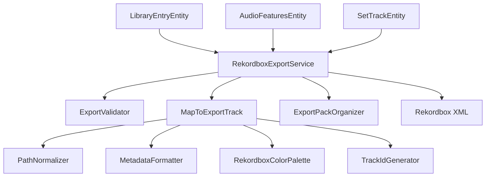

# ORBIT Architecture: Phase 4 Export Pipeline

The Phase 4 Export Pipeline is the deployment bridge that translates ORBIT's deep musical intelligence into industry-standard metadata and cues for Rekordbox DJ hardware.

## 🏗️ Component Overview

### 1. ORBIT Export Service (`RekordboxExportService`)
The orchestrator. It manages the lifecycle of an export session, from validation to XML generation and file organization.

### 2. The Intelligence Mapper (`MapToExportTrack`)
The "Brain" of the export process. It synthesizes multiple data sources into a normalized `ExportTrack` model:
- **Cues**: Merges manual `OrbitCue` objects with auto-detected `PhraseSegment` data.
- **Roles**: Automatically assigns Rekordbox types (Hot Cues vs. Memory Cues) based on the cue's structural role.
- **Colors**: Maps ORBIT roles (Drop, Build, Intro) to official Pioneer standard RGB values.

### 3. Forensic Metadata Formatter (`MetadataFormatter`)
Encodes ORBIT-exclusive intelligence into the Rekordbox **Comment** field using a structured `[ORBIT]` block.
- **Fields**: Energy, Instrumental Probability, Forensic Notes, and Transition Reasoning.
- **Culture Safety**: Enforces `InvariantCulture` (dots for decimals) to prevent parsing errors on non-English DJ systems.

### 4. Cross-Platform Path Normalizer (`PathNormalizer`)
Ensures that tracks are findable across Windows and macOS.
- **Standard**: Converts local paths to `file://localhost/` URI format.
- **Encoding**: Properly escapes spaces and special characters (`%20`) for reliable Rekordbox import.

### 5. Pre-flight Validator (`ExportValidator`)
Prevents "broken" exports by checking:
- Physical file existence.
- Mandatory metadata (BPM, Key).
- Analysis status (ensures AI features like segments are present).

## 🧠 Intelligence Mapping Logic

| ORBIT Feature | Rekordbox Equivalent | Type | Target Color |
| :--- | :--- | :--- | :--- |
| **Intro / Outro** | Structural Marker | Memory Cue | Green |
| **Drop** | Energy Landmark | Memory Cue | Red |
| **Build** | Transition Zone | Memory Cue | Orange |
| **Breakdown** | Mid-section | Memory Cue | Yellow |
| **User Cues** | Trigger Points | Hot Cue | Custom (Blue/Purple) |
| **Mix-In Point** | Set Alignment | Hot Cue (Slot 7) | Purple |

## 🛠️ Data Flow

1. **Validation**: `ExportValidator` checks all chosen tracks/sets.
2. **Translation**: `MapToExportTrack` creates normalized export models.
3. **Encoding**: `MetadataFormatter` and `PathNormalizer` prepare strings for XML.
4. **Serialization**: `RekordboxExportService` generates the final `COLLECTION` and `PLAYLISTS` XML nodes.
5. **Assembly**: `ExportPackOrganizer` creates the folder structure, copies audio (if required), and writes the XML + README.
