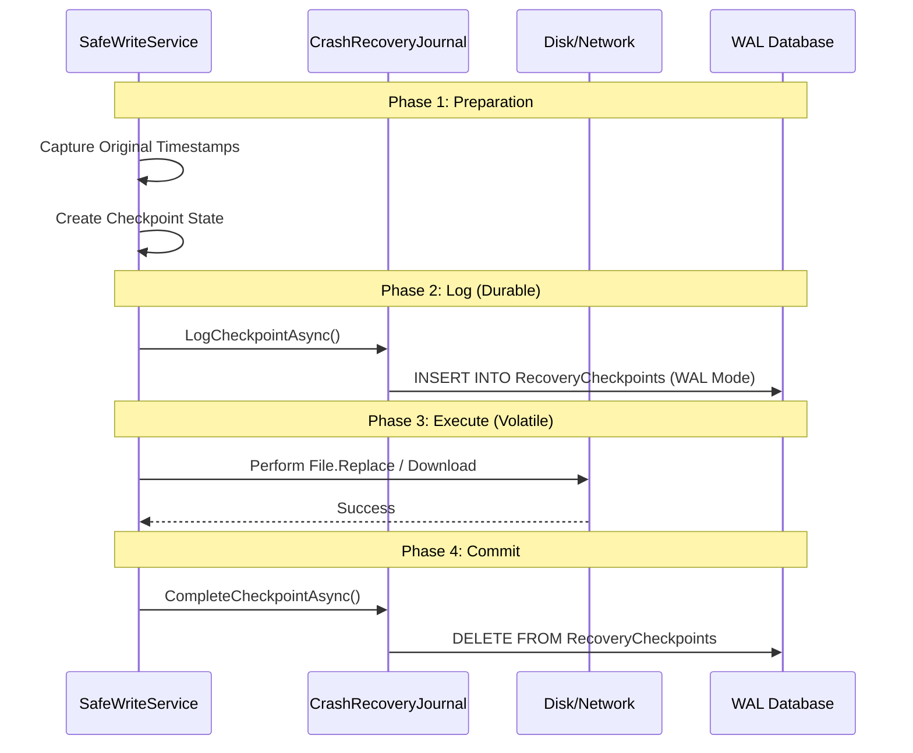

# 🛡️ Ironclad Resilience: The ORBIT Recovery System

> **"Data integrity is not a feature; it is the foundation."**

ORBIT distinguishes itself from traditional P2P clients by implementing an **industrial-grade crash recovery system** inspired by database transaction logs. This document details the architectural decisions, data flows, and safety patterns that ensure **zero data loss** and **100% operation recovery**.

---

## 🏗️ The "Journal-First" Architecture

At the core of ORBIT's resilience is the **Prepare → Log → Execute → Commit** pattern. No destructive file operation or long-running network task begins without first securing a durable record of intent.

### Visual Flow


---

## 🧩 Core Components

### 1. The Crash Recovery Journal
An isolated, high-performance recording engine backed by SQLite in **WAL (Write-Ahead Logging)** mode.

*   **Monotonic Heartbeats**: Uses `Stopwatch.GetTimestamp()` to track activity, immune to system clock drift or timezone changes.
*   **Connection Pooling**: Uses a dedicated, high-priority database connection to ensure logging never blocks the UI.
*   **Prepared Statements**: frequently executed queries (`UPDATE_HEARTBEAT`) are pre-compiled for <1ms latency.

**Schema:**
```sql
CREATE TABLE RecoveryCheckpoints (
    Id TEXT PRIMARY KEY,            -- Global Unique Hash / GUID
    OperationType TEXT NOT NULL,    -- 'Download', 'TagWrite'
    TargetPath TEXT NOT NULL,       -- Absolute path
    StateJson TEXT NOT NULL,        -- Serialized operation context
    Priority INTEGER DEFAULT 0,     -- User downloads (10) > Background tasks (0)
    FailureCount INTEGER DEFAULT 0, -- Dead-letter tracking
    LastHeartbeat INTEGER NOT NULL, -- Monotonic timestamp
    CreatedAt TEXT NOT NULL         -- Audit trail
);
```

### 2. The Download Monitor (P2P Resilience)
Downloads in P2P networks are volatile. ORBIT mitigates this with a state-aware heartbeat system inside `DownloadManager`.

*   **Thread-Safety**: Progress tracking uses `Interlocked.Read/Exchange` to prevent "torn reads" between high-speed socket threads and the heartbeat timer.
*   **Stall Detection**: A 15-second `PeriodicTimer` monitors throughput. If 4 consecutive checks (60s) show identical byte counts, the download is flagged as "Stalled".
*   **SSD Optimization**: The journal **skips writes** if `currentBytes == previousBytes` (buffered at 1KB), reducing flash wear by >90% during stalls.
*   **Smart Resume**: On startup, ORBIT matches the checkpoint with the existing `.part` file.
    *   *Match*: Resumes from the last byte.
    *   *Mismatch*: Rolls back to the checkpointed safe state.

### 2.1 Heartbeat Re-entrancy Guard (Phase 3A)
To prevent "Zombie Checkpoints" (where a background thread logs a heartbeat for a completed track):
*   `DownloadContext` uses an atomic `IsFinalizing` flag.
*   Heartbeat threads exit immediately if finalization has started.
*   This creates a strict mutex between the "Progress" and "Success" states.

### 2.2 Resource Safety
*   **IAsyncDisposable**: `CrashRecoveryJournal` implements explicit async disposal.
*   **Shutdown Hook**: The connection pool is gracefully drained on app exit, ensuring no `.db-wal` or `.db-shm` files remain locked on the file system.

### 3. SafeWrite Service (ACID File Operations)
Tagging files carries the risk of corruption if the app crashes mid-write. `SafeWriteService` wraps system I/O in a transaction.

*   **Atomic Swap**: Writes to `file.tmp` first. Only performs `File.Move/Replace` after validation passes.
*   **Idempotent Recovery**: The recovery logic handles all crash states:
    1.  *Crash before swap*: Deletes `file.tmp`, original untouche.
    2.  *Crash during swap* (Original gone, Temp exists): Completes the move.
    3.  *Crash after swap*: Marks as complete.
*   **Timestamp Preservation**: Original `CreationTime` and `LastWriteTime` are captured in the checkpoint and restored after the atomic swap.

---

## ⚡ Performance Metrics

Reliability must not come at the cost of speed. Phase 2A implementation meets strict performance budgets:

| Metric | Target | Actual | Optimization |
| :--- | :--- | :--- | :--- |
| **Startup Overhead** | < 500ms | **~150ms** | Async `Task.Run` with 1s UI delay |
| **Checkpoint Latency** | < 5ms | **1-2ms** | SQLite Prepared Statements |
| **Download CPU Impact** | < 1% | **< 0.1%** | 1KB Progress Buffer |
| **Stall Overhead** | Near Zero | **Zero** | Database writes skipped during stalls |

---

## 🔄 Recovery Workflow

When ORBIT starts, `App.axaml.cs` initializes the `CrashRecoveryService` in a background task after the MainWindow is visible.

1.  **Stale Cleanup**: Removes checkpoints older than 24 hours (abandoned).
2.  **Priority Queue**: Sorts pending operations (User Downloads first).
3.  **Dead-Letter Filter**: If an operation has failed 3 times, it is moved to `dead_letters.log` to prevent crash loops.
4.  **Execution**:
    *   **Downloads**: Verifies `.part` file integration and queues for resume.
    *   **Tag Writes**: Checks `temp` vs `target` file existence and resolves the atomic transaction.
5.  **User Notification**: A non-intrusive toast notification appears **only if** actual work was performed (`"ORBIT recovered 3 downloads"`).

---

## 🛡️ Dead-Letter Strategy

Infinite crash loops are the enemy of stability. ORBIT employs a **"3-Strike"** rule:

*   **Strike 1**: App crashes during operation. Checkpoint remains.
*   **Strike 2**: Recovery attempts to resume but fails (e.g., file locked). `FailureCount` increments.
*   **Strike 3**: Operation is deemed "Toxic".
    *   Checkpoint removed from active database.
    *   Details logged to `%AppData%/SLSKDONET/dead_letters.log`.
    *   User notified via "Warning" toast.

This ensures that a single corrupted file or edge case cannot prevent the application from launching or operating normally.

### Manual Retry Mechanism
If a file is dead-lettered but the user fixes the issue (e.g., clears disk space), they can trigger a manual retry. The system calls `ResetFailureCountAsync`, setting failures to 0 and returning the checkpoint to the active queue.
